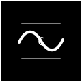

# Clotho

<p align="center">
  
</p>

<p align="center">
  <strong>Version control and collaboration for humans and AI agents working concurrently.</strong>
</p>

<p align="center">
  <a href="./docs/vision-spec.md">Vision</a>
  ·
  <a href="./docs/prd.md">Product PRD</a>
  ·
  <a href="./docs/adr">ADRs</a>
  ·
  <a href="./collab/README.md">Forgejo Boundary</a>
</p>

---

## What Is Clotho?

Clotho is an open, modular version control and collaboration platform for the
world where commits, reviews, issues, and operational work are produced by
humans and AI agents at the same time.

The goal is simple to say and hard to build:

- **Vercel-simple**: create a repo, push work, open the product UI, and invite
  agents without YAML archaeology.
- **Cloudflare-robust**: expose a calm surface over real primitives: VCS,
  storage, collaboration, agent identity, merge queues, and compute.
- **Agent-native**: agents are first-class identities with scoped credentials,
  audited actions, checkpoints, structured diffs, and merge-queue writes.
- **Open and self-hostable**: every major subsystem should be swappable, and the
  project should remain practical to run outside a managed cloud.

Clotho is not a GitHub skin. It is a decoupled product shell and API over a set
of independently replaceable services.

---

## Current Status

Clotho is an active prototype moving toward a real product surface.

Completed foundations include:

- jj-lib-backed VCS engine writing real git objects.
- Xet-style content-defined storage over S3-compatible object storage.
- Forgejo adopted as an unmodified internal collaboration provider.
- Merge queue that serializes per repo and lands conflicts as first-class
  commits.
- MCP agent gateway with scoped tokens, audit log, checkpoint/restore,
  structured diff, commit, and submit tools.
- REST API gateway used by both the web app and CLI.
- Rust `clotho` CLI for repo creation, status, log, PR lookup, commit, and
  submit flows.
- Next.js product shell with native Clotho repo, PR, issue, Actions, agent,
  storage, insight, and settings views.

See [docs/prd.md](./docs/prd.md) for stage-by-stage implementation notes.

---

## Architecture

```text
humans / agents
  |
  |  browser, CLI, MCP clients
  v
+-----------------------+        +--------------------------+
| apps/web              |        | clotho-agent-gateway     |
| product UI            |        | MCP + agent identity     |
+-----------+-----------+        +------------+-------------+
            |                                 |
            | REST                            | gRPC / HTTP
            v                                 v
+----------------------------------------------------------+
| clotho-api-gateway                                       |
| public REST edge and collaboration facade                |
+------+----------------+------------------+---------------+
       |                |                  |
       v                v                  v
+-------------+  +--------------+  +-----------------------+
| clotho-vcs  |  | clotho-diff  |  | clotho-merge-queue    |
| jj-lib      |  | tree-sitter  |  | serialized landing    |
+------+------+  +--------------+  +-----------------------+
       |
       | real git objects
       v
+----------------------------------------------------------+
| internal providers                                       |
| Forgejo · Postgres · S3-compatible storage · compute     |
+----------------------------------------------------------+
```

### Layer Responsibilities

| Layer | Responsibility |
|---|---|
| `apps/web` | Product UI for repositories, PRs, issues, Actions, agents, storage, insights, and settings |
| `clotho-api-gateway` | Public REST edge, collaboration facade, webhook handling, and composition over internal services |
| `clotho-agent-gateway` | MCP server, scoped agent tokens, authorization, audit log, and agent-facing tools |
| `clotho-vcs` | jj-lib-backed VCS engine with real git-compatible object storage |
| `clotho-storage` | Arachne storage engine: Xet-style chunk dedup over S3-compatible object storage |
| `storage-sdk-bridge` | Optional open StorageSDK adapter layer for external stores plus agent snapshots/forks |
| `clotho-merge-queue` | Per-repo serialized integration and first-class conflict commits |
| `clotho-diff` | Tree-sitter structured diffs for humans and agents |
| Forgejo | Internal collaboration provider for git HTTP, issues, PRs, comments, statuses, and webhooks |

Clotho repositories are typed as `code`, `model`, or `dataset`. Model and
dataset repos automatically route artifacts at or above 1 MiB through Arachne
(10 MiB for code), with a per-repository policy editable from the web app, CLI,
or API. The standard stack needs no `.env` file for this behavior.

Every repository also has a Clotho-owned semantic artifact manifest. Model
weights (Safetensors, GGUF, ONNX, PyTorch, TensorFlow), tokenizers, dataset
shards (Parquet, Arrow, JSONL, CSV), schemas, cards, and evaluations are
classified with logical sizes and publication-readiness checks. The web app,
CLI, and SDK consume that control-plane view without exposing Forgejo or
downloading multi-gigabyte Arachne payloads.

Tailscale is a first-class NetworkProvider: connect an org OAuth client from
Clotho settings, verify it live, and mark repositories `public` or `tailscale`
with scoped tags. Private repos fail closed when network attachment is not
available instead of silently running over public egress. Provider credentials
live in Clotho's encrypted vault; Docker generates a persistent vault key when
an explicit master key is not supplied.

GPU compute is repository policy too. CCI advertises provider GPU capability
and supported types; a repo can select `accelerator: gpu` and preferences such
as H100/H200. Daytona-backed Actions translate that intent to the official
`daytona-gpu` snapshot while keeping provider syntax out of the repository.

---

## Repository Layout

| Path | Purpose |
|---|---|
| [`apps/web`](./apps/web) | Main Clotho product app, built with Next.js |
| [`apps/site`](./apps/site) | Marketing/teaser site |
| [`crates`](./crates) | Rust services and CLI |
| [`packages/sdk-js`](./packages/sdk-js) | Typed JavaScript client for the REST API |
| [`packages/ui`](./packages/ui) | Shared design tokens and UI assets |
| [`proto`](./proto) | Shared protobuf service definitions |
| [`collab`](./collab) | Forgejo submodule boundary and collaboration notes |
| [`infra`](./infra) | Docker and future deployment assets |
| [`docs`](./docs) | Vision, PRD, ADRs, and proposals |
| [`scripts`](./scripts) | Setup, provisioning, and demo scripts |

---

## Development

Prerequisites:

- Rust stable
- `protoc`
- Docker
- Node.js 20+
- `pnpm`
- `just`

Install JavaScript dependencies:

```sh
just setup
```

Run the full local stack:

```sh
just dev
```

No `.env` file is required for the default local stack. Optional managed
provider credentials can be connected from Clotho settings; environment
variables remain an escape hatch for automation and deployment.

Local service defaults:

| Service | URL |
|---|---|
| Web app | http://localhost:3100 |
| REST API gateway | http://localhost:8080 |
| MCP agent gateway | http://localhost:8090/mcp |
| Forgejo debug UI | http://localhost:13000 |
| MinIO | http://localhost:9000 |

Forgejo is intentionally a debug/internal provider in normal Clotho workflows.
The product UI and SDK should talk to `clotho-api-gateway`, not Forgejo.

Run checks:

```sh
cargo fmt --all --check
cargo clippy --workspace --all-targets -- -D warnings
cargo test --workspace
pnpm turbo build lint typecheck test
```

Stack-dependent smoke tests:

```sh
just test-collab
just test-agent
just test-storage
```

Do not run `just dev-down` casually: it removes Docker volumes.

---

## Deployment Direction

Clotho is designed to ship as a set of versioned containers plus a small number
of required backing services:

- Postgres for control-plane data.
- S3-compatible object storage for Arachne.
- Persistent git repository storage.
- Forgejo as an internal provider, until Clotho replaces or abstracts more of
  that surface.
- A CCI-compatible compute provider for Actions runs; Daytona is the first
  configured provider.

Expected future deployment targets:

| Target | Intended Use |
|---|---|
| Docker Compose | Local development, demos, single-node self-hosting |
| Helm chart | Production self-hosting on Kubernetes |
| Managed Clotho Cloud | Hosted free/paid product operated by the Clotho team |
| CLI installer | Eventually, a friendlier single-node install path |

The monorepo should publish:

- one container image per Rust service;
- one container image for `apps/web`;
- release binaries for the `clotho` CLI;
- Helm/Kustomize or Compose deployment assets.

---

## Licensing

Clotho's own code is intended to be distributed Apache-2.0 style. See
[LICENSE](./LICENSE).

Forgejo is GPLv3 and lives behind a clear runtime/API boundary:

- `collab/forgejo` is a submodule pinned to an upstream Forgejo release.
- The dev stack runs the unmodified official Forgejo container image.
- Clotho talks to Forgejo over HTTP and shared git object storage.
- Forgejo source modifications require a deliberate decision and must respect
  Forgejo's GPLv3 license.

See [collab/README.md](./collab/README.md) and
[ADR-0003](./docs/adr/0003-forgejo-integration-adopt.md).

---

## Project Docs

- [Vision Spec](./docs/vision-spec.md)
- [Product PRD](./docs/prd.md)
- [Architecture Decision Records](./docs/adr)
- [Stage 9 Proposal](./docs/proposals/stage-9-product-shell-collaboration-facade.md)
- [Stage 10 Proposal](./docs/proposals/stage-10-actions-compute-control-plane.md)

---

## Name

Clotho is named for the Fate who spins the thread. The platform is built around
the same idea: many human and agent hands continuously spinning one coherent
commit graph forward.
